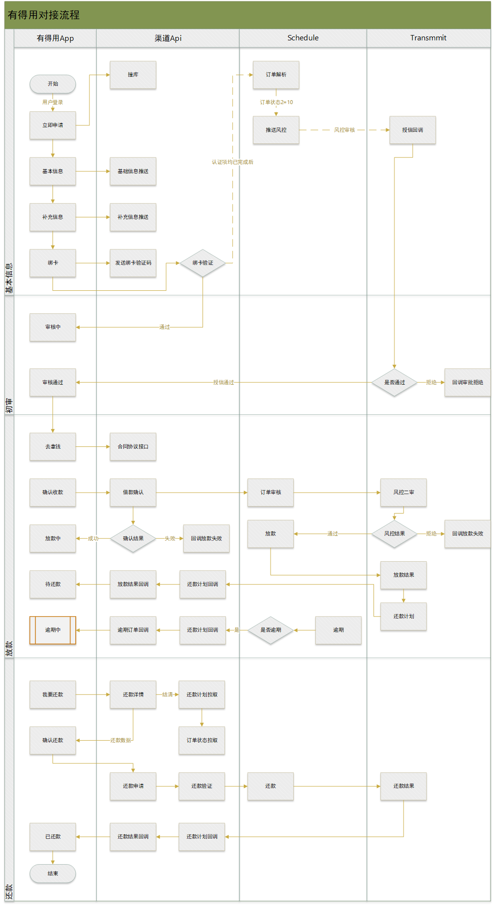

# 有得用对接开发设计文档

## 业务背景

接业务方通知，树贷熊接一个新的API渠道“有得用”

## Git分支

`20190628_fenqi_lijing_dey2rp`

## 交互流程

交互流程图详见产品需求附件

## 业务流程

有得用对接业务流程图



## 基础功能

1. 有得用拦截器（包含验签）

   `新增`

2. 撞库接口

   `新增`

3. 基本信息推送接口

   `新增`

4. 补充信息推送接口

   `新增`

5. 银行卡列表接口

   `新增`

6. 绑卡接口

   `新增`

7. 绑卡验证码接口

   `新增`

8. 拉取订单审批结果

   `新增`

9. 借款试算接口

   `新增`

10. 借款确认（审批确认）接口

    `新增`

11. 合同接口

    `新增`

12. 还款计划拉取接口

    `新增`

13. 拉取订单状态接口

    `新增`

14. 主动还款接口

    `新增`

15. 还款验证码接口

    `新增`

16. 还款详情获取接口

    `新增`

## 回调功能

1. 授信回调

   对方接口名称：审批反馈结论接口 4.8

   调用场景：

   当机构完成审批时，调用有得用接口反馈审批结果

2. 绑卡结果回调 

   对方接口名称：绑卡反馈接口 4.7

   调用场景：

   当机构获取到最终的绑卡结果时，需要调用有得用接口告知用户绑卡结果

3. 订单状态回调

   对方接口名称：订单状态反馈接口 4.14

   调用场景：

   1. 机构放款完成时，即变成放款成功或放款失败时，调用有得用接口。

   2. 订单状态变更为贷款取消时，调用有得用接口

   3. 订单状态变更为逾期时，调用有得用接口

   4. 订单状态变更为贷款结清时，调用有得用接口

4. 还款结果回调

   对方接口名称：还款结果反馈接口4.19

   调用场景：

   1. 代扣完成后，不论还款成功，还是还款失败时

   2. 用户主动还款后，获取到还款结果后

5. 还款计划回调

   对方接口名称：还款计划推送4.12

   调用场景：

   1. 放款完成后，调用有得用接口告知还款计划

   2. 用户还款后，调用有得用接口更新还款计划

   3. 用户逾期后，调用有得用接口更新还款计划

   4. 用户更换还款银行卡后，调用有得用接口更新还款计划中的银行卡

   5. 其他情况导致还款计划变更，调用有得用接口更新还款计划

## 定时任务

1. 订单解析

   `新增`

2. 渠道授信定时任务（修改）

   ```java
   ThirdOrderApplyCreditJob
   ```

3. 风控审核申请定时任务（修改）

   ```java
   BorrowRiskApplyJob
   ```

## MQ消息队列

1. 订单审核结果消费者

   `新增`

2. 授信审核结果消费者

   `新增`

3. 逾期结果消费者

   `新增`

4. 放款结果消费者

   `新增`

5. 还款结果消费者

   `新增`

6. 还款计划消费者

   `新增`

## 其它

1. 渠道配置（产品）

2. 产品配置、产品费用、产品费率配置（产品）

3. 产品流程控制配置

4. 短信签名配置

5. 运营商类型配置

6. 快捷支付开关配置

7. 短信开关配置

8. 协议配置

9. 撞库规则配置

10. 渠道 `openapi_sys_config` 相关配置

    


